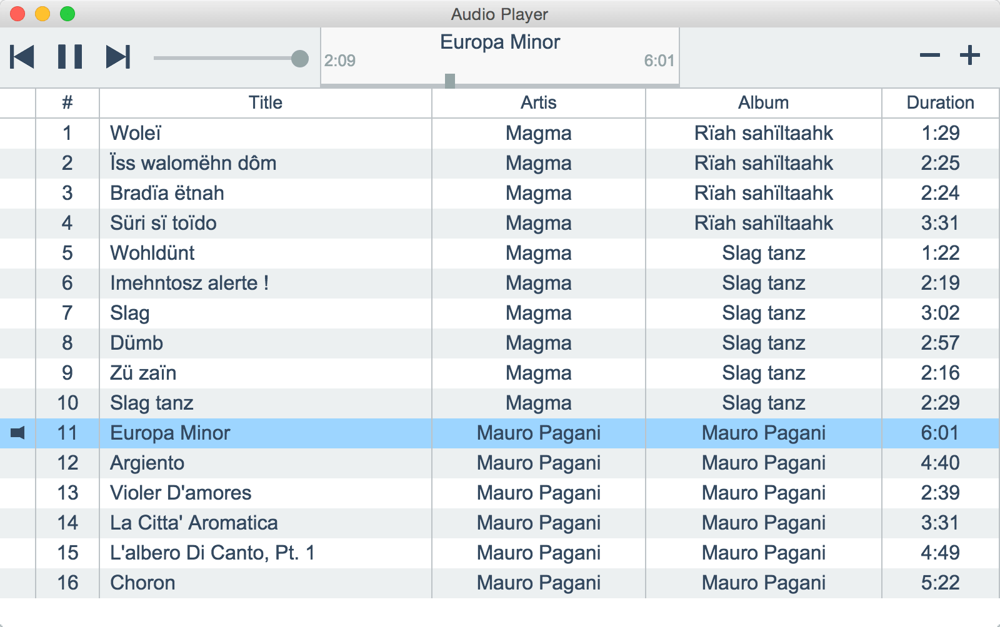

# nw.js - Audio Player

Example of simple audio player in [NW.js](https://github.com/nwjs/nw.js).

## Installation & Build

1. Install [Node.js](https://nodejs.org/)
1. `git clone https://github.com/akabekobeko/examples-nw.git`
1. `cd audio player`
1. `npm install`
1. Run npm commands
 * `npm start` is a development build & start watch files
 * `npm run app` is a launcher app on NW.js
 * `npm run release` is a release build ( create nw.js app package )

## Remarks

* [Using MP3 & MP4 (H.264) using the video & audio tags.](https://github.com/nwjs/nw.js/wiki/Using-MP3-%26-MP4-%28H.264%29-using-the--video--%26--audio--tags.)

## License

MIT