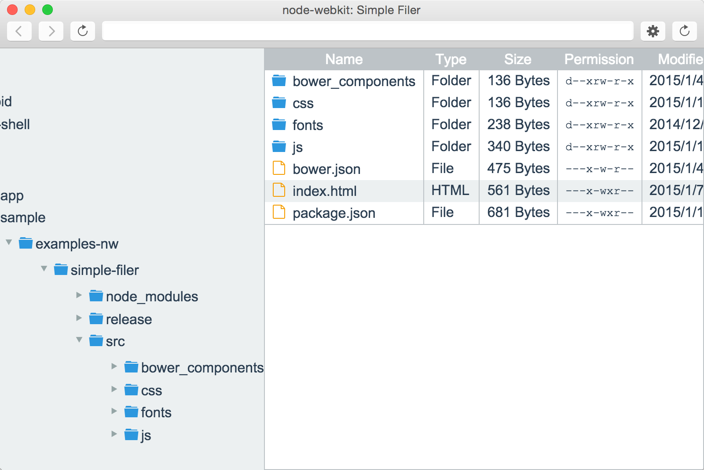

# node-webkit: Simple Filer

Example of the simple filer in [node-webkit](https://github.com/rogerwang/node-webkit "node-webkit").

# Installation & Build

1. Install node.js, gulp and bower
1. git clone https://github.com/akabekobeko/examples-nw.git
1. cd simple-filer
1. npm install
1. cd src
1. bower install
1. cd ..
1. Run "gulp js" or "gulp release"
 * "gulp js" is dev build ( compile for scripts )
 * "gulp release" is release build ( create node-webkit app )
